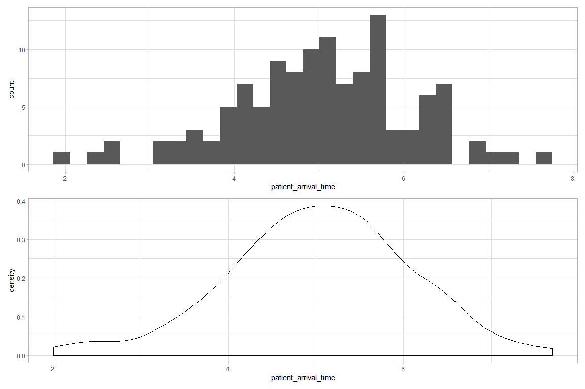
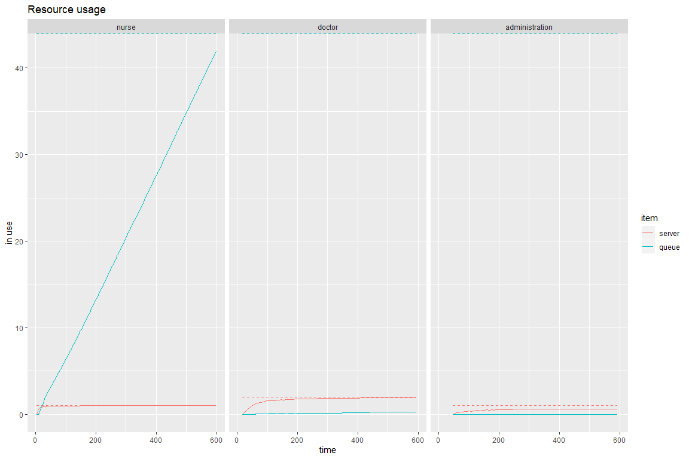
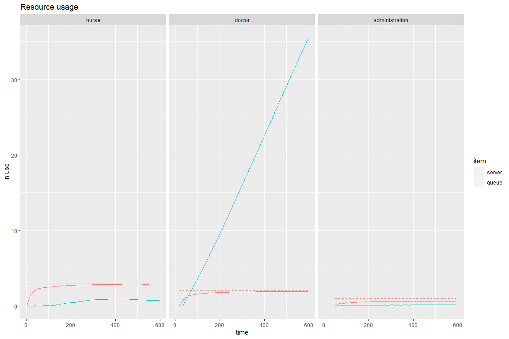
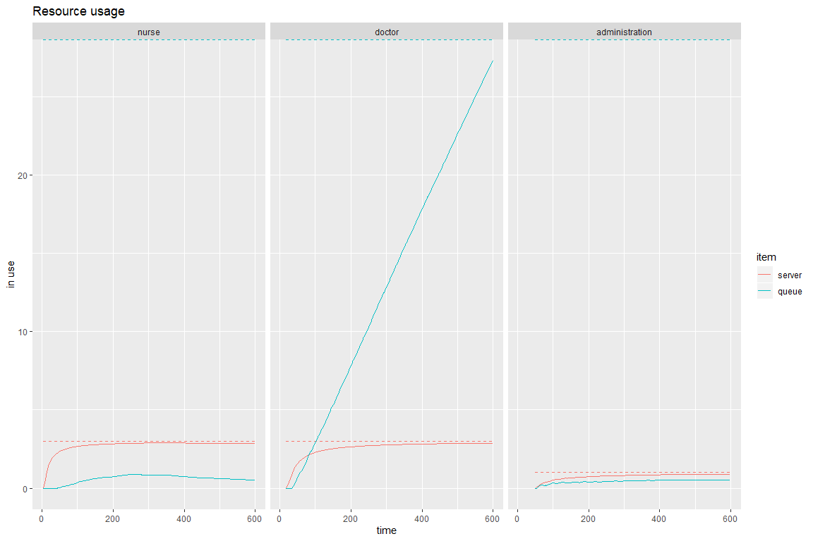
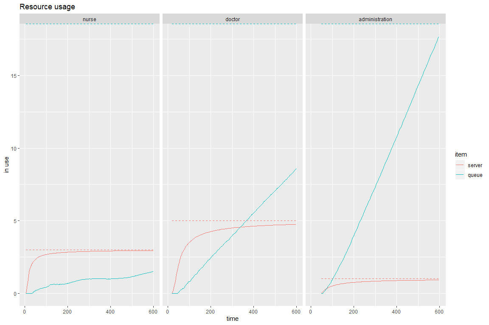
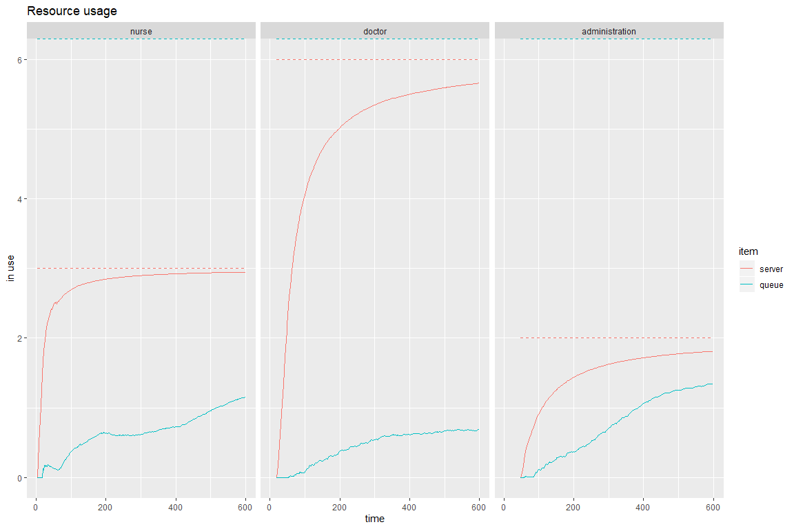
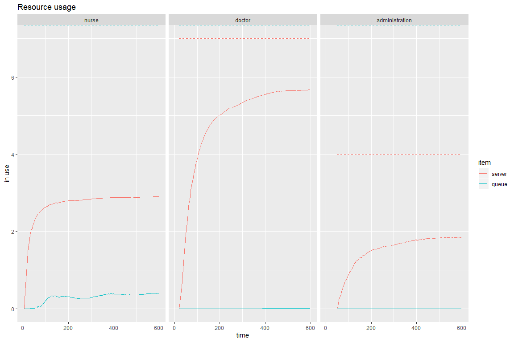

## R version

```{.bg-success}
##  [1] "x86_64-w64-mingw32"           "x86_64"                      
##  [3] "mingw32"                      "x86_64, mingw32"             
##  [5] ""                             "3"                           
##  [7] "6.2"                          "2019"                        
##  [9] "12"                           "12"                          
## [11] "77560"                        "R"                           
## [13] "R version 3.6.2 (2019-12-12)" "Dark and Stormy Night"
```

## Python version


```{.bg-success}
## Python version 3.7.3 (default, Apr 24 2019, 15:29:51) [MSC v.1915 64 bit (AMD64)]
```

## Problem statement: Finding optimal staff at a dental clinic to keep patient waiting time under 3 minutes.
This is another form of managing demand [a.k.a patients] with supply [a.k.a doctor, nurse and administrator]

A dental clinic <b>XYZ</b> takes only walk-in patients and runs 10 hours a day say 9:00 AM - 7:00 PM. A patient will first interact with a nurse for intake for 15 minutes, proceed to a doctor consultation for 30 minutes and then finally handled by an administrative professional for 10 minutes to schedule next appointment. 

Let's start simulating the clinic operations assuming that every patient will go through the same path 

<ul> 
<li> Patients arrive on average every 5 minutes with a standard deviation of 1 minute </li>
<li> Nurse (intake for 15 minutes) </li>
<li> Doctor (consultation for 30 minutes)</li> 
<li>Administrator (schedule next appointment for 10 minutes)</li>
</ui>


## Simulation begins here 

#### Step 1 of 4: setup environment in simmer


#### Step 2 of 4: setup patient path a.k.a trajectory (demand)


#### Step 3 of 4: Setup number of resources and their constraints (supply)
<ul>
<li> # Nurse : 1 </li>
<li> # Doctor: 2 </li>
<li> # Administrators: 1 </li>
</ul>


#### Here's how patient arrival time distribution will look like
<!-- -->
<font color='blue'> Based on above charts there is a high porbability that there could be a patient arriving the clinic every five minutes on average, however it is also possible that there could be a patient arriving every two minutes during peak time (say evening) and a patient arriving every eight minutes during non peak time (say morning).This <b> randomness of demand (a.k.a patient arrival) creates uncertainity </b> leading to inefficient operations. Therefore, simulations are a preferred way to handle uncertainity in planning operations (in our case - we are referring to XYZ dental clinic operations)
</font>

#### Step 4 of 4: Run simulation 
<ul>
<li> 10 hours or 600 minutes </li>
</ul>


### Let's analyze results
From these visuals, let's identify if there is any bottleneck in the operations

#### How does waiting time look like at each of the resources (nuse, doctor, and administrator) ?


```{.bg-success}
## [1] "Average wait for  36  patients was  178.131455715304 minutes."
```
<font color='red'> As we notice that average wait time is way above 3 minutes per patient, let's understand where in the patient path are we noticing higher wait times. Let take a deep dive </font>

<!-- -->

<font color='red'> Here, we focus on queue line representing number of patients waiting in queue and red dotted line representing the capacity of our resources i.e., 1 nurse, 2 doctors, and 1 administrator. Upon further analysis, we found that <b>Queue (a.k.a number of patients waiting in queue)</b> is very high at Nurse. For instance, there are 40 patients wiating in the queue at the end of the day to complete intake form and nurse can't handle the volume of patients arriving at the clinic. This shows us that capacity of nurse is not sufficient to meet the patient demand i.e., <b><u> number of nurses at the clinic is a  bottleneck </u></b>. Therefore, it is recommended to increase number of nurses to three at the clinic and re-run the simulation.

#### Running with increase nurse capacity (# Nurse = 3)


#### Let's analyze our new results

```{.bg-success}
## [1] "Average wait for  36  patients was  168.753657969459 minutes."
```

<!-- -->

<font color='red'> After adding two more nurses, we notice <b> bottleneck shifted form nurses to doctors </b>. Now, two doctors in the clinic can't handle the demand of patients and 30+ patients ar waiting for doctor consultation. This still doesn't solve our problem and causes poor patient experience. Therefore, let's keep three nurses and increase doctor capacity to three and re-run our simulation  </font>


#### Running with increase nurse capacity (# Nurse = 3 and Doctors = 3)


#### Let's analyze our new results

```{.bg-success}
## [1] "Average wait for  54  patients was  137.590924299268 minutes."
```

<!-- -->
<font color='red'> Upon analyznig the graphs, we notice three doctors are still not able to meet patient demand leading to poor patient experience at the clinic. so, lets increse our doctors to five and re-run simulation. </font>


#### Running with increase nurse capacity (# Nurse = 3 and Doctors = 5)


#### Let's analyze our new results

```{.bg-success}
## [1] "Average wait for  53  patients was  139.70571591641 minutes."
```

<!-- -->
<font color='red'> <b>We notice both doctors and administrators are bottlenecks now.</b> So, lets increase each of their capacity by one and re-run simulation</font>


#### Running with increase nurse capacity (# Nurse = 3 and Doctors = 6 and Administrators = 2)


#### Let's analyze our new results

```{.bg-success}
## [1] "Average wait for  105  patients was  15.8755031048829 minutes."
```

<!-- -->
<font color='orange'>Now we notice there are <b><u> no bottlenecks </b></u> and none of the patients are waiting at any of our resources throughout the day. However, average wait time is still above 3 minute expectation set for XYZ detnal clinic. Let's increase each of our resource capcity by one and re-run the simulation.</font>

#### Running with increase nurse capacity (# Nurse = 3 and Doctors = 7 and Administrators = 3)


#### Let's analyze our new results

```{.bg-success}
## [1] "Average wait for  108  patients was  1.91896286352454 minutes."
```

<!-- -->
<font color='green'>After running with multiple resource (doctor, nurse and administrator) combination, now we notice there are <b><u> no bottlenecks and we are meeting less than 3 minute patient wait time SLA expectation </b></u>
Therefore, we conclude that the optimal staffing model for XYZ Dental clinic to meet less than 3 minute waiting time is
<ul>
<li>Number of nurses : 3 </li>
<li>Number of doctors : 7 </li>
<li>Number of administrators: 4 </li>
<ul>

With these many resources, XYZ clinic can provide world class dental treatment with just 1.9 minutes of wait time per patient.
</font>

